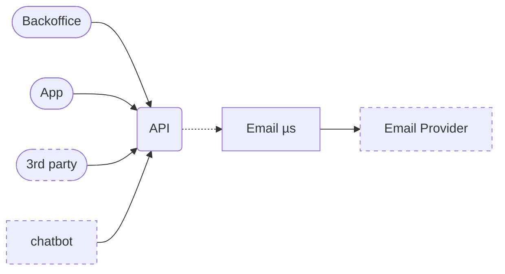

Cyrius Tech Test
================

Hello and welcome to Cyrius' technical test :)

It turns out an intern has made a bad rebase & force push and we lost a whole
bunch of code. Help us recover it!

To help you, we managed to salvage some files from people laptops.

Because it's an all hands on deck situation, you are only expected to make the
`yarn bdd` && `yarn contract` command pass and make a pull request with your
changes.

Good luck, have fun!

--------------------------------------------------------------------------------

## Contributing

### Requirements

- node lts (`nvm install --lts`) [nvm](https://github.com/nvm-sh/nvm#install--update-script)
- yarn (`npm install -g yarn`)
- docker & docker-compose w/o root access
- an environment variable `ENV=development`

- And finnaly run: `yarn install`

Note: Everything was made for mac & un*x system. Some tweaks may be required for
windows.

### Infra

### Yarn commands

- `up` & `down` - start stops the infra locally
- `doc` - Generate http & async api documentation in `./docs`
- `bdd` - run bdd tests (in ./feature)
  - `bdd:watch` - run the test suite in watch mode
  - `bdd:coverage` - run the test suite with coverage
- `contract` - run rest contract tests (in ./contract/rest)
  - `bdd:watch` - run the test suite in watch mode
  - `bdd:coverage` - run the test suite with coverage
- `dev` - starts the dev server in watch mode
- `ts:migrate` - perform a migration in dev env [called before `dev` & `test`s]

Because test & dev commands requires local env variables, there is a `lc` helper
command (`yarn lc <command> <parameters>`) that preloads the env for you, e.g:
`yarn lc dev` or `yarn lc bdd:watch`

### File structure

- `blueprint/` - Contains raw api documentation
- `contract/` - REST Api contract tests
- `docker/` - everything docker related
- `env/` - env variables
- `features/` - contains bdd tests (i suggest you start there)
- `src/` - Source code
  - `src/scripts` - migration script

Ignored:
- node_modules/ - duh
- reports/ - cucumber & coverage reports
